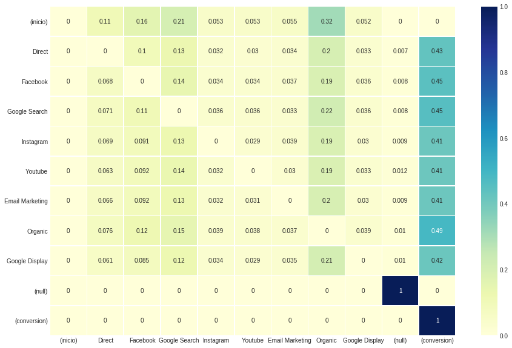
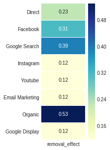
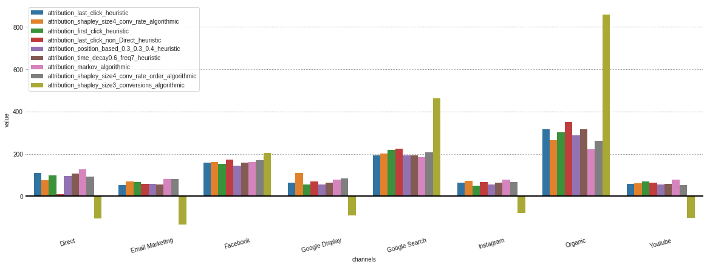
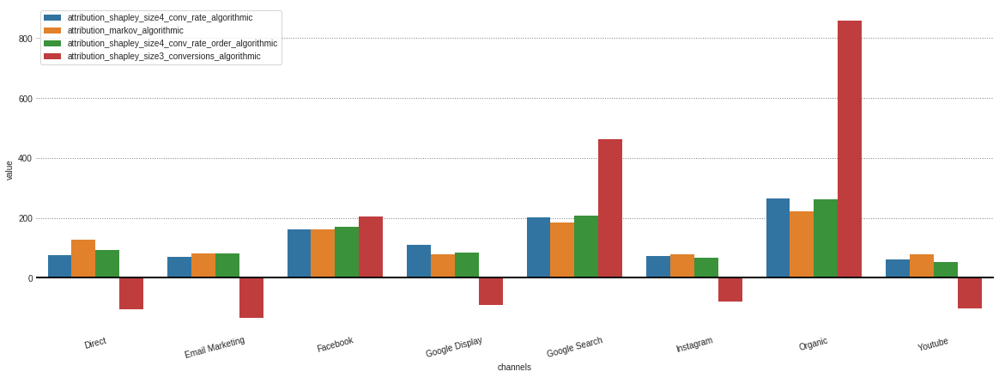

# Marketing Attribution Models

## 1. Sobre a Classe
Classe em Python desenvolvida para soluções de problemas de atribuição de mídia em Marketing Digital.

## 2. Sobre Atribuição Multicanal
No contexto digital, antes de conversão, o usuário é impactado por diversos pontos de contato, podendo gerar jornadas cada vez mais longas e complexas. 

*Como atribuir os créditos das conversões e otimizar o investimento em mídia online?*

Para resolver esse problema, utilizamos **Modelos de Atribuição**.


### 2.1 Tipos de Modelos

#### Modelos Heurísticos

- **Last Interaction**:
    - Modelo padrão de atribuição tanto do Google Analytics, quanto de ferramentas de mídia como Google Ads e Facebook Business manager;
    - Atribui todo o resultado da conversão para o último ponto de contato.

- **Last non-Direct Click**:
    - Todo o tráfego direto é ignorado, e 100% do crédito da venda vai para o último canal por meio do qual o cliente chegou ao site antes de concluir a conversão.

- **First Interaction**:
    - Atribui todo o resultado da conversão para o primeiro ponto de contato.

- **Linear**:
    - Cada ponto de contato no caminho de conversão.

- **Time Decay**:
    - Os pontos de contato mais próximos em termos de tempo da venda ou conversão recebem a maior parte do crédito. 

- **Position Based**:
    - No modelo de atribuição Com base na posição, 40% do crédito é atribuído a cada primeira e última interação, e os 20% de crédito restantes são distribuídos uniformemente para as interações intermediárias.


#### Modelos Algorítmicos

#### **Shapley Value**

Conceito vindo da Teoria dos Jogos, para distribuir a contribuição de cada jogador em um jogo de cooperação.

Atribui os créditos das conversões calculando a contribuição de cada canal presente na jornada, utilizando permutações de jornadas com e sem o canal em questão.


**Por exemplo**, como podemos atribuir as 19 conversões na jornada abaixo?

Natural Search > Facebook > Direto > **$19** 


O Shapley Value de cada canal é calculado com base em observações, isto é, para cada jornada, é preciso ter o valores de conversão para todas as combinações que a compõe. 


Natural Search > **$7** <br/>
Facebook > **$6** <br/>
Direto > **$4** <br/>
Natural Search > Facebook > **$15** <br/>
Natural Search > Direto > **$7** <br/>
Facebook > Direto > **$9** <br/>
Natural Search > Facebook > Direto > **$19** <br/>


O número de iterações aumenta exponencialmente com o número de canais: da ordem de 2^N, sendo N o número de canais.

Assim, para uma jornada com 3 canais são necessárias 8 cálculos. **Para jornadas com mais de 15 canais, se torna praticamente inviável.**


O Shapley Value por padrão não considera a ordem dos canais,mas sim a contribuição da presença dele na jornada.
Para levar isso em consideração é preciso aumentar a ordem do numero de combinações. 

Disso vem a dificuldade em usar um método que considere a *ordem dos canais* para um grande número N, pois, além das 2^N interações para o cálculo do Shapley Value de um determinado canal i, **precisamos da *observação* do canal i em todas as possíveis posições.**


**Pontos negativos do Shapley Value**
- Limita o número de pontos de contato uma vez que o número de iteração é da ordem de 2^N;
- Se não ordenado, o Shapley Value considera que a contribuição de um canal A é a mesma se antecedido por B ou por C;
- Se ordenado, o número de combinações cresce muito e as jornadas devem estar disponíveis, caso contrário atribui-se zero àquela jornada;
- Canais que estão poucos presentes ou presentes em jornadas longas vão ter pequenas contribuições;


#### **Cadeias de Markov**
Uma cadeia de Markov é um caso particular de processo estocástico com a propriedade de que a distribuição de probabilidade do próximo estado depende apenas do estado atual e não na sequência de eventos que o precederam.


Utilizando cadeias de markov no contexto de atribuição multicanal, podemos calcular a probalidade de interações entre os canais de mídia por meio da **Matriz de Transição**.


Para encontrar a contribuição de cada canal, utilizamos o **Removal Effect**: remove-se o canal em questão da jornada e calcula-se a probabilidade de conversão.

A atribuição é dada pela razão entre a diferença da probabilidade total de conversão e a probabilidade de conversão sem o canal, e a probabilidade total de conversão original.

Quanto maior o removal effect, maior a contribuição do canal para a conversão.


**Os processos markovianos não possuem nenhum tipo de restrição em relação a quantidade ou ordem dos canais e
considera a sequência de canais como uma parte fundamental do algoritmo**.


### 2.2 Referências
- [Attribution Models in Marketing](https://data-science-blog.com/blog/2019/04/18/attribution-models-in-marketing/)
- [Attribution Theory: The Two Best Models for Algorithmic Marketing Attribution – Implemented in Apache Spark and R](http://datafeedtoolbox.com/attribution-theory-the-two-best-models-for-algorithmic-marketing-attribution-implemented-in-apache-spark-and-r/)
- [Game Theory Attribution: The Model You’ve Probably Never Heard Of](https://clearcode.cc/blog/game-theory-attribution/)
- [Marketing Channel Attribution With Markov Models In R](https://www.bounteous.com/insights/2016/06/30/marketing-channel-attribution-markov-models-r/?ns=l)
- [Multi-Channel Funnels Data-Driven Attribution](https://support.google.com/analytics/topic/3180362?hl=en&ref_topic=3205717)
- [Marketing Multi-Channel Attribution model with R (part 1: Markov chains concept)](https://analyzecore.com/2016/08/03/attribution-model-r-part-1/)
- [Marketing Multi-Channel Attribution model with R (part 2: practical issues)](https://analyzecore.com/2017/05/31/marketing-multi-channel-attribution-model-r-part-2-practical-issues/)
- [ml-book/shapley](https://christophm.github.io/interpretable-ml-book/shapley.html)
- [Overview of Attribution modeling in MCF](https://support.google.com/analytics/answer/1662518?hl=en)

## 3. Importando a Classe


```python
>> pip install marketing_attribution_models
```


```python
from marketing_attribution_models import MAM
```

## 4. Demonstração

### **Criando o objeto MAM**

**A criação do objeto MAM** é baseado em **dois formatos de Data Frame** e que é guiado pelo parâmetro group_channels:

*   **group_channels = True**. Espera-se receber uma base na qual **cada linha seria uma sessão da jornada do usuário**.
  * Esse data frame deve conter colunas representando ID do Usuário, indicação booleana se houve ou não transação durante a sessão, timestamp da sessão e o canal na qual o usuário gerou a sessão;
*   **group_channels = False**. Recebe a base na qual a **jornada já foi agrupada** e que cada linha representa uma jornada completa de determinado usuário até a conversão. Para os usuários do Google Analytics, essa base pode ser gerada através da exportação do relatório de Top Conversion Paths na aba de Conversions.
  * Nesse caso a coluna de canais e time_till_conv_colname receberiam em cada linha uma jornada separada por um separador, ' > ' como padrão e que pode ser alterado no parâmetro path_separator.

No nosso caso, iremos apresentar um exemplo na qual as jornadas ainda não estão agrupadas, que cada linha representa uma jornada e que ainda não temos um ID de Cada Jornada.

**Ponto de Atenção:**
A classe já contempla uma função representada pelo parâmetro create_journey_id_based_on_conversion, que caso seja True, será criado um ID da Jornada baseado nas colunas de ID do Usuário, passada no parâmetro group_channels_id_list e a coluna que representa se houve ou não conversão, passada no parâmetro journey_with_conv_colname.

Nesse caso, serão ordenadas as sessões de cada usuário e a cada transação será criado um novo ID da Jornada. Entretanto, **encorajamos que seja criado um ID da Jornada com base no conhecimento de negócio de cada base explorada**. Podendo criar condições expecíficas de tempo para que haja uma quebra de jornada, como por explempo se identificado que a jornada média de determidado negócio dura 1 semana até a conversão, podemos adotar um critério que se determinado usuário não interagir com o site por uma semana, sua jornada será quebrada, pois pode haver uma quebra de interesse.


Exemplificando como seria a configuração dos parametros no cenário descrito acima com group_channels = True. 

1. Deve ser passado o **Pandas Data Frame** contendo a base de dados a ser analisada;
2. Indicar o formato da base em **group_channels**=True
3. Nome da coluna que contem os agrupamentos de canais em **channels_colname**;
4. Coluna Booleana indicando se houve ou não conversão na sessão em **journey_with_conv_colname**;
5. Lista contendo os nomes das colunas que representam o ID da Jornada, podendo ser uma combinação de colunas em **group_channels_by_id_list**. Mas nesse caso como estamos indicando que iremos criar um ID da Jornada no parâmetro **create_journey_id_based_on_conversion = True**, basta indicar a coluna de ID do Usuário; 
6. Coluna representando a data em que ocorreu a sessão em **group_timestamp_colname**. Coluna que pode receber além dos dias do ano, o horário em que a sessão ocorreu;
7. Por fim, em nosso caso, indicamos que iremos gerar um ID da Jornada a partir das colunas indicadas nos parâmetros group_channels_by_id_list e journey_with_conv_colname, em **create_journey_id_based_on_conversion** = True


```python
attributions = MAM(df,
    group_channels=True,
    channels_colname = 'channels',
    journey_with_conv_colname= 'has_transaction',
    group_channels_by_id_list=['user_id'],
    group_timestamp_colname = 'visitStartTime',
    create_journey_id_based_on_conversion = True)
```

Para fins exploratórios e de aprendizado, implementamos uma forma de gerar uma **base de dados aleatória** através do parâmetro **random_df=True**. Não sendo necessário o preenchimento dos demais.


```python
attributions = MAM(random_df=True)
```

Assim que o objeto foi criado, podemos checar como ficou a **base após a criação do journey_id e o agrupamento das sessões** em joranadas através do **atributo .DataFrame.**


```python
attributions.DataFrame
```
|  | journey_id | channels_agg | time_till_conv_agg | converted_agg | conversion_value |
| - | - | - | - | - | - |
| 0 | id:0_J:0 | Facebook | 0.0 | True | 1 |
| 1 | id:0_J:1 | Google Search | 0.0 | True | 1 |
| 2 | id:0_J:10 | Google Search > Organic > Email Marketing | 72.0 > 24.0 > 0.0 | True | 1 |
| 3 | id:0_J:11 | Organic | 0.0 | True | 1 |
| 4 | id:0_J:12 | Email Marketing > Facebook | 432.0 > 0.0 | True | 1 |
| ... | ... | ... | ... | ... | ... |
| 20341 | id:9_J:5 | Direct > Facebook | 120.0 > 0.0 | True | 1 |
| 20342 | id:9_J:6 | Google Search > Google Search > Google Search | 48.0 > 24.0 > 0.0 | True | 1 |
| 20343 | id:9_J:7 | Organic > Organic > Google Search > Google Search | 480.0 > 480.0 > 288.0 > 0.0 | True | 1 |
| 20344 | id:9_J:8 | Direct > Organic | 168.0 > 0.0 | True | 1 |
| 20345 | id:9_J:9 | Google Search > Organic > Google Search > Emai... | 528.0 > 528.0 > 408.0 > 240.0 > 0.0 | True | 1 |

Esse **atributo é atualizado para cada modelo gerado** e nos casos dos resultados heurísticos, será adicionado uma coluna contendo a atribuição dada por determinado modelo no final.

**Atenção:**
Os cálculos dos modelos não são calculados com base no parâmetro .DataFrame, caso ele seja alterado, os resultados não serão afetados.


```python
attributions.attribution_last_click()
attributions.DataFrame
```

| | journey_id | channels_agg | time_till_conv_agg | converted_agg | conversion_value |
| - | - | - | - | - | - |
| 0 | id:0_J:0 | Facebook | 0.0 | True | 1 |
| 1 | id:0_J:1 | Google Search | 0.0 | True | 1 |
| 2 | id:0_J:10 | Google Search > Organic > Email Marketing | 72.0 > 24.0 > 0.0 | True | 1 |
| 3 | id:0_J:11 | Organic | 0.0 | True | 1 |
| 4 | id:0_J:12 | Email Marketing > Facebook | 432.0 > 0.0 | True | 1 |
| ... | ... | ... | ... | ... | ... |
| 20341 | id:9_J:5 | Direct > Facebook | 120.0 > 0.0 | True | 1 |
| 20342 | id:9_J:6 | Google Search > Google Search > Google Search | 48.0 > 24.0 > 0.0 | True | 1 |
| 20343 | id:9_J:7 | Organic > Organic > Google Search > Google Search | 480.0 > 480.0 > 288.0 > 0.0 | True | 1 |
| 20344 | id:9_J:8 | Direct > Organic | 168.0 > 0.0 | True | 1 |
| 20345 | id:9_J:9 | Google Search > Organic > Google Search > Emai... | 528.0 > 528.0 > 408.0 > 240.0 > 0.0 | True | 1 |


Como trabalhamos com um grande volume de dados, sabemos que não é possivel avaliar os resultados atribuídos para cada jornada que resultou em uma transação. Assim, através da consulta do **atributo group_by_channels_models trazemos os resultados dos modelos agrupados por cada canal**. 

**Atenção:**
Os resultados agrupados não se sobrescrevem caso o mesmo modelo seja calculado mais de uma vez e ambos resultados estarão presentes no atributo group_by_channels_models.


```python
attributions.group_by_channels_models
```


<div>

| channels | attribution_last_click_heuristic |
| -- | -- |
| Direct | 2133 |
| Email Marketing | 1033 |
| Facebook | 3168 |
| Google Display | 1073 |
| Google Search | 4255 |
| Instagram | 1028 |
| Organic | 6322 |
| Youtube | 1093 |


E como acontece com o .DataFrame, o **group_by_channels_models também é atualizado para cada novo modelo rodado** e sem a limitação de não trazer os resultados algorítimicos


```python
attributions.attribution_shapley()
attributions.group_by_channels_models
```

| | channels | attribution_last_click_heuristic | attribution_shapley_size4_conv_rate_algorithmic |
| - | - | - | - |
| 0 | Direct | 109 | 74.926849 |
| 1 | Email Marketing | 54 | 70.558428 |
| 2 | Facebook | 160 | 160.628945 |
| 3 | Google Display | 65 | 110.649352 |
| 4 | Google Search | 193 | 202.179519 |
| 5 | Instagram | 64 | 72.982433 |
| 6 | Organic | 315 | 265.768549 |
| 7 | Youtube | 58 | 60.305925 |

### **Sobre os modelos**

Todos os modelos heurísticos apresentam o mesmo comportamento quanto à atualização dos **atributos .DataFrame e .group_by_channels_models** e também quanto ao **output do método** que irá retornar uma **tupla contendo dois pandas Series**.


```python
attribution_first_click = attributions.attribution_first_click()
```

**O primeiro output** da tupla corresponde aos resultados na **granularidade de jornada**, similar ao resultado encontrado no .DataFrame


```python
attribution_first_click[0]
```


    0                          [1, 0, 0, 0, 0]
    1                                      [1]
    2              [1, 0, 0, 0, 0, 0, 0, 0, 0]
    3                                   [1, 0]
    4                                      [1]
                           ...                
    20512                               [1, 0]
    20513                            [1, 0, 0]
    20514    [1, 0, 0, 0, 0, 0, 0, 0, 0, 0, 0]
    20515                            [1, 0, 0]
    20516                         [1, 0, 0, 0]
    Length: 20517, dtype: object


**Já o segundo** corresponde aos resultados na **granularidade de canal**, similar ao resultado encontrado no .DataFrame


```python
attribution_first_click[1]
```

|  | channels | attribution_first_click_heuristic |
| - | - | - |
| 0 | Direct | 2078 |
| 1 | Email Marketing | 1095 |
| 2 | Facebook | 3177 |
| 3 | Google Display | 1066 |
| 4 | Google Search | 4259 |
| 5 | Instagram | 1007 |
| 6 | Organic | 6361 |
| 7 | Youtube | 1062 |

#### **Customização dos modelos**

Dentre os modelos presentes na classe apenas o Last Click, o First Click e Linear não possuem parametros customizáveis além do **parametro group_by_channels_models**, que recebe um **valor booleano** e que caso **falso**, **não irá retornar os resultados dos modelos agrupados por canais**.

##### **Modelo Last Click Non** 

Foi criado para replicar o comportamento padrão do Google Analytics na qual o **tráfego Direto é sobreposto** caso ocorra após alguma interação de outra origem dentro de determinado período.

Por padrão o parâmetro but_not_this_channel recebe o valor 'Direct', mas pode ser alterado para outros canais / valores de acordo com os seus canais e agrupamentos.


```python
attributions.attribution_last_click_non(but_not_this_channel='Direct')[1]
```

| channels | attribution_last_click_non_Direct_heuristic |
| - | - | - |
| 0 | Direct | 11 |
| 1 | Email Marketing | 60 |
| 2 | Facebook | 172 |
| 3 | Google Display | 69 |
| 4 | Google Search | 224 |
| 5 | Instagram | 67 |
| 6 | Organic | 350 |
| 7 | Youtube | 65 |

##### **Modelo Position Based** 

Pode receber uma lista no parâmetro **list_positions_first_middle_last** determinando os percentuais que serão atribuídos para o ínicio, meio e fim da jornada de acordo com o contexto de negócio do seu cliente/dado. E que **por padrão** é distribuído com os percentuáis **40% para o canal introdutor, 20% distribuído para os canais intermediários e 40% para o conversor.**


```python
attributions.attribution_position_based(list_positions_first_middle_last=[0.3, 0.3, 0.4])[1]
```

|  | channels | attribution_position_based_0.3_0.3_0.4_heuristic |
| - | - | - |
| 0 | Direct | 95.685085 |
| 1 | Email Marketing | 57.617191 |
| 2 | Facebook | 145.817501 |
| 3 | Google Display | 56.340693 |
| 4 | Google Search | 193.282305 |
| 5 | Instagram | 54.678557 |
| 6 | Organic | 288.148896 |
| 7 | Youtube | 55.629772 |

##### **Modelo Time Decay** 

Pode ser curtomizado quanto ao **percentual de decaimento** no parâmetro **decay_over_time** e quanto ao **tempo em horas na qual esse percentual será aplicado** no parâmetro **frequency**.

Contudo, vale salientar que caso haja mais pontos de contato entre os espaços de tempo do decaimento, o valor será distribuído igualmente para esses canais;

Exemplo de funcionamento do modelo:
- **Canais:** Facebook > Organic > Paid Search
- **Tempo até a Conversão:** 14 > 12 > 0
- **Frequência do decaimento:** 7
- **Resultados atribuídos:**
  - 25% para Facebook;
  - 25% para Organic;
  - 50% para Paid Search;


```python
attributions.attribution_time_decay(
    decay_over_time=0.6,
    frequency=7)[1]
```

|  | channels | attribution_time_decay0.6_freq7_heuristic |
| - | - | - |
| 0 | Direct | 108.679538 |
| 1 | Email Marketing | 54.425914 |
| 2 | Facebook | 159.592216 |
| 3 | Google Display | 64.350107 |
| 4 | Google Search | 192.838884 |
| 5 | Instagram | 64.611414 |
| 6 | Organic | 314.920082 |
| 7 | Youtube | 58.581845 |

##### **Markov Chains**

**Modelo de Atribuição** baseado em **Cadeias de Markov** nos auxilia a solucionar o problema de atribuição de mídia com uma **abordagem algorítimica** baseada em dados que calcula a probabilidade de transição entre canais.

Esse modelo se comporta como os demais quanto a atualização do .DataFrame e do .group_by_channels_models, além de **retornar uma tupla** com os dois primeiros resultados representando os mesmos descritos anteriormente nos modelos heurísticos. Contudo, obtemos dois outputs, a **matriz de transição** e o **removal effect**.

Como parâmetro de entrada temos, a princípio, como indicar se irá ser considerado ou não a probabilidade de transição para o mesmo estado.


```python
attribution_markov = attributions.attribution_markov(transition_to_same_state=False)
```

|  | channels | attribution_markov_algorithmic |
| - | - | - |
| 0 | Direct | 2305.324362 |
| 1 | Email Marketing | 1237.400774 |
| 2 | Facebook | 3273.918832 |
| 3 | Youtube | 1231.183938 |
| 4 | Google Search | 4035.260685 |
| 5 | Instagram | 1205.949095 |
| 6 | Organic | 5358.270644 |
| 7 | Google Display | 1213.691671 |

Essa configuração **não afeta os resultados agregados** e que são atribuídos para cada canal, **mas sim os valores observados na matriz de transição**. E como inficamos **transition_to_same_state=False** a linha diagonal, que representa a auto-transição, aparece zerada.


```python
ax, fig = plt.subplots(figsize=(15,10))
sns.heatmap(attribution_markov[2].round(3), cmap="YlGnBu", annot=True, linewidths=.5)
```





**Removal Effect**, quarto output dos resultados attribution_markov, é dada pela razão entre a diferença da probabilidade total de conversão e a probabilidade de conversão sem o canal, e a probabilidade total de conversão original.


```python
ax, fig = plt.subplots(figsize=(2,5))
sns.heatmap(attribution_markov[3].round(3), cmap="YlGnBu", annot=True, linewidths=.5)
```





##### **Shapley Value**

Por fim, temos o segundo modelo algorítmico da classe MAM o **Shapley Value**, conceito vindo da **Teoria dos Jogos**, para distribuir a contribuição de cada jogador em um jogo de cooperação.

Modelo atribui os créditos das conversões calculando a contribuição de cada canal presente na jornada, utilizando combinações de jornadas com e sem o canal em questão. 

Parâmetro **size limita quantidade de canais únicos na jornada**, por **padrão** é definido como os **4 últimos**. Isso ocorre pois o número de iterações aumenta exponencialmente com o número de canais. Da ordem de 2N, sendo N o número de canais.   

A metodologia do cálculo das contribuições marginais pode variar através do **parâmetro order**, que por padrão calcula a contribuição da **combinação dos canais independende da ordem em que aparecem** nas diferentes jornadas.


```python
attributions.attribution_shapley(size=4, order=True, values_col='conv_rate')[0]
```

|  | combinations | conversions | total_sequences | conversion_value | conv_rate | attribution_shapley_size4_conv_rate_order_algorithmic |
| - | - | - | - | - | - | - |
| 0 | Direct | 909 | 926 | 909 | 0.981641 | [909.0] |
| 1 | Direct > Email Marketing | 27 | 28 | 27 | 0.964286 | [13.948270234099155, 13.051729765900845] |
| 2 | Direct > Email Marketing > Facebook | 5 | 5 | 5 | 1.000000 | [1.6636366232390172, 1.5835883671498818, 1.752... |
| 3 | Direct > Email Marketing > Facebook > Google D... | 1 | 1 | 1 | 1.000000 | [0.2563402919193473, 0.2345560799963515, 0.259... |
| 4 | Direct > Email Marketing > Facebook > Google S... | 1 | 1 | 1 | 1.000000 | [0.2522517802130265, 0.2401286956930936, 0.255... |
| ... | ... | ... | ... | ... | ... | ... |
| 1278 | Youtube > Organic > Google Search > Google Dis... | 1 | 2 | 1 | 0.500000 | [0.2514214624662836, 0.24872101523605275, 0.24... |
| 1279 | Youtube > Organic > Google Search > Instagram | 1 | 1 | 1 | 1.000000 | [0.2544401477637237, 0.2541071889956603, 0.253... |
| 1280 | Youtube > Organic > Instagram | 4 | 4 | 4 | 1.000000 | [1.2757196742326997, 1.4712839059493295, 1.252... |
| 1281 | Youtube > Organic > Instagram > Facebook | 1 | 1 | 1 | 1.000000 | [0.2357631944623868, 0.2610913781266248, 0.247... |
| 1282 | Youtube > Organic > Instagram > Google Search | 3 | 3 | 3 | 1.000000 | [0.7223482210689489, 0.7769049003203142, 0.726... |

Por fim, parâmetro na qual o Shapley Value será calculado pode ser alterado em **values_col**, que por padrão utiliza a **taxa de conversão** que é uma forma de **considerarmos as não conversões no cálculo do modelo**. Contudo, também podemos considerar no cálculo o total de conversões ou o valor gerados pelas conversões, como demostrado abaixo. 


```python
attributions.attribution_shapley(size=3, order=False, values_col='conversions')[0]
```

|  | combinations | conversions | total_sequences | conversion_value | conv_rate | attribution_shapley_size3_conversions_algorithmic |
| - | - | - | - | - | - | - |
| 0 | Direct | 11 | 18 | 18 | 0.611111 | [11.0] |
| 1 | Direct > Email Marketing | 4 | 5 | 5 | 0.800000 | [2.0, 2.0] |
| 2 | Direct > Email Marketing > Google Search | 1 | 2 | 2 | 0.500000 | [-3.1666666666666665, -7.666666666666666, 11.8... |
| 3 | Direct > Email Marketing > Organic | 4 | 6 | 6 | 0.666667 | [-7.833333333333333, -10.833333333333332, 22.6... |
| 4 | Direct > Facebook | 3 | 4 | 4 | 0.750000 | [-8.5, 11.5] |
| ... | ... | ... | ... | ... | ... | ... |
| 75 | Instagram > Organic > Youtube | 46 | 123 | 123 | 0.373984 | [5.833333333333332, 34.33333333333333, 5.83333... |
| 76 | Instagram > Youtube | 2 | 4 | 4 | 0.500000 | [2.0, 0.0] |
| 77 | Organic | 64 | 92 | 92 | 0.695652 | [64.0] |
| 78 | Organic > Youtube | 8 | 11 | 11 | 0.727273 | [30.5, -22.5] |
| 79 | Youtube | 11 | 15 | 15 | 0.733333 | [11.0] |

### Visualização
E agora que temos os resultados atribuídos pelos diferentes modelos guardados em nosso objeto **.group_by_channels_models** de acordo com o nosso contexto de negócio podemos plotar um gráfico e comparar os resultados.


```python
attributions.plot()
```





Caso queira selecionar apenas os modelos algorítimicos, podemos especifica-lo no **parâmetro model_type**.


```python
attributions.plot(model_type='algorithmic')
```





